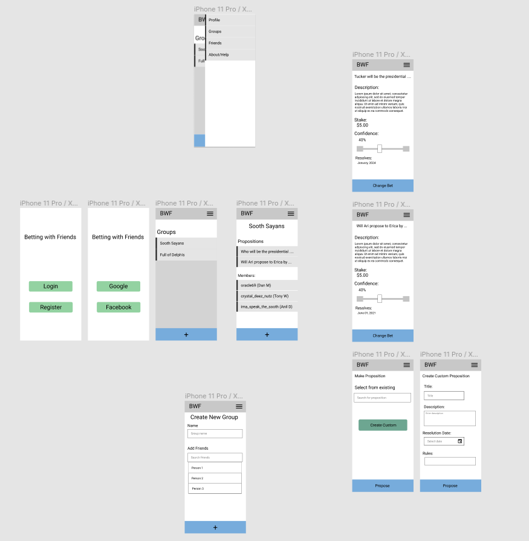

# Betting with Friends App

I'd like to use the readme file as a place to show diagrams and share links. Tony, please add links to the talks you watched.

## Communication

How do we want to do communication? We can use Github issues for specific software issues. [Github projects](https://github.com/adhurjaty/prediction-app/projects/1) is a good Kanban board for communicating current state of tasks. Google calendars works for everyone for scheduling meetings? How do we want to do day-to-day communication. I prefer texting -- I'm not usually that responsive to email and I often forget about emails. We could start a Whatsapp group? What do you guys prefer?

## Diagrams

### Use cases

## Screens

- Registration
- Login
- Home
- Profile
- Group
- Search proposition
- Create proposition
- View proposition
- Resolve proposition

### [Figma Prototype](https://www.figma.com/file/l9ut96y0hhfi9cqbxNSx94/Untitled?node-id=4%3A55)

If you want to edit the Figma diagram, open your own instance of Figma and import the PredictApp.fig file, make edits, save over it and commit.

## Links

- [Solidity tutorial](https://docs.soliditylang.org/en/v0.8.2/introduction-to-smart-contracts.html) and [by example](https://docs.soliditylang.org/en/v0.8.2/solidity-by-example.html)
- [Solidity Tutorial from freeCodeCamp](https://www.youtube.com/watch?v=ipwxYa-F1uY&ab_channel=freeCodeCamp.org)
- [TechCrunch interview with Vitalik Buterin](https://www.youtube.com/watch?v=WSN5BaCzsbo&ab_channel=TechCrunch)
- [Ethereum Networks](https://ethereum.org/en/developers/docs/networks/): The deployed software that does the blockchain thing. There's the real thing called 'Mainnet'; and 'Testnets' that offer 'faucets' to add gas to indicated accounts - could be used for our funny money
- [Ethereum Development Networks](https://ethereum.org/en/developers/docs/development-networks/): Used for local development, implementations include [Ganache](https://www.trufflesuite.com/ganache) (part of Truffle) and [Hardhat](https://hardhat.org/)
- [Interesting DAO concept](https://github.com/molochventures/moloch) that (supposedly) disincentives anti-cooperative actions. Maybe we can incorporate some of these concepts.
