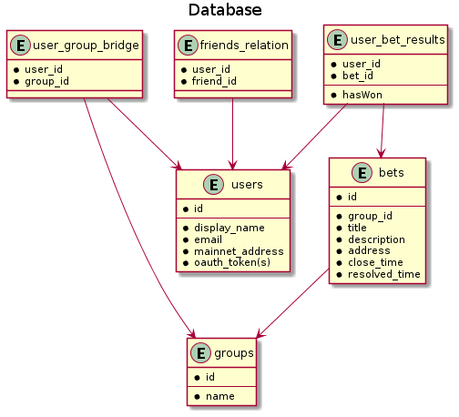

# Betting with Friends App

I'd like to use the readme file as a place to show diagrams and share links. Tony, please add links to the talks you watched.

## Communication

How do we want to do communication? We can use Github issues for specific software issues. [Github projects](https://github.com/adhurjaty/prediction-app/projects/1) is a good Kanban board for communicating current state of tasks. Google calendars works for everyone for scheduling meetings? How do we want to do day-to-day communication. I prefer texting -- I'm not usually that responsive to email and I often forget about emails. We could start a Whatsapp group? What do you guys prefer?

## Diagrams

### Architecture

### Use cases

### Database

## Screens

- Registration
- Login
- Home
- Profile
- Group
- Search proposition
- Create proposition
- View proposition
- Resolve proposition

### [Figma Prototype](https://www.figma.com/file/dT8jDjIrj4orLPvB9qpWzq/PredictApp?node-id=0%3A1)

If you want to edit the Figma diagram, open your own instance of Figma and import the PredictApp.fig file, make edits, save over it and commit.

## Domain Definitions

### Global Domain

- **Bet**: Item up for making a wager on. A bet **resolves** to yes or no (for now) **outcome** upon some resolution condition
- **Resolution**: The point when the bet has an outcome
- **Resolution Event**: The real world event that should trigger a resolution of the bet
- **App Outcome**: The status of the resolved bet
- **True Outcome**: The real world status of the resolution event
- **Prediction**: A user's prediction of the app outcome
- **Bet**: A User's **wagered** amount on a predicted Outcome
- **Wager**: The amount of ether, USD, or prestige points in a bet per person

### Database

- **User**: user of the application. Is able to log in and interact with the application
- **Group**: Group of users that share bets and statistics. Bets are all scoped to groups

### Smart Contract

- **Member**:  A User with membership in the Group that is participating in a given Bet. A Member may participate in that Bets through wagers and, depending on the Resolver, may vote to resolve the Bet. A member is a user in the database sense
- **Commissioner**: The administrator for a given Bet, typically handled by the API backend service. A Commissioner creates Bets, adds/removes Members, and sets the Resolver. The Commissioner may not bet in the Bet or vote on its resolution.
- **Bet**: The smart contract for the bet in the global domain sense
- **Resolver**: The smart contract that handles resolution conditions for the proposition smart contract
- **Resolution Vote**: A vote that reflects the event outcome (should trigger a proposition resolution under some condition)
- **Defection?**: A vote that a true outcome has not occurred

## Links

- [Solidity tutorial](https://docs.soliditylang.org/en/v0.8.2/introduction-to-smart-contracts.html) and [by example](https://docs.soliditylang.org/en/v0.8.2/solidity-by-example.html)
- [Solidity Tutorial from freeCodeCamp](https://www.youtube.com/watch?v=ipwxYa-F1uY&ab_channel=freeCodeCamp.org)
- [TechCrunch interview with Vitalik Buterin](https://www.youtube.com/watch?v=WSN5BaCzsbo&ab_channel=TechCrunch)
- [Ethereum Networks](https://ethereum.org/en/developers/docs/networks/): The deployed software that does the blockchain thing. There's the real thing called 'Mainnet'; and 'Testnets' that offer 'faucets' to add gas to indicated accounts - could be used for our funny money
- [Ethereum Development Networks](https://ethereum.org/en/developers/docs/development-networks/): Used for local development, implementations include [Ganache](https://www.trufflesuite.com/ganache) (part of Truffle) and [Hardhat](https://hardhat.org/)
- [Interesting DAO concept](https://github.com/molochventures/moloch) that (supposedly) disincentives anti-cooperative actions. Maybe we can incorporate some of these concepts.
- [Blockchain basics](https://www.youtube.com/watch?v=bBC-nXj3Ng4&ab_channel=3Blue1Brown)
  - This is the best explanation of how the Bitcoin blockchain works. I've sent this video to so many people
- [Decent Ethereum VM explanation](https://www.youtube.com/watch?v=BsDq2mzC5tk&ab_channel=TommyCooksey)
- [Walkthrough simple prediction market app](https://www.youtube.com/watch?v=jgpyeu5nABI&ab_channel=EatTheBlocks)
