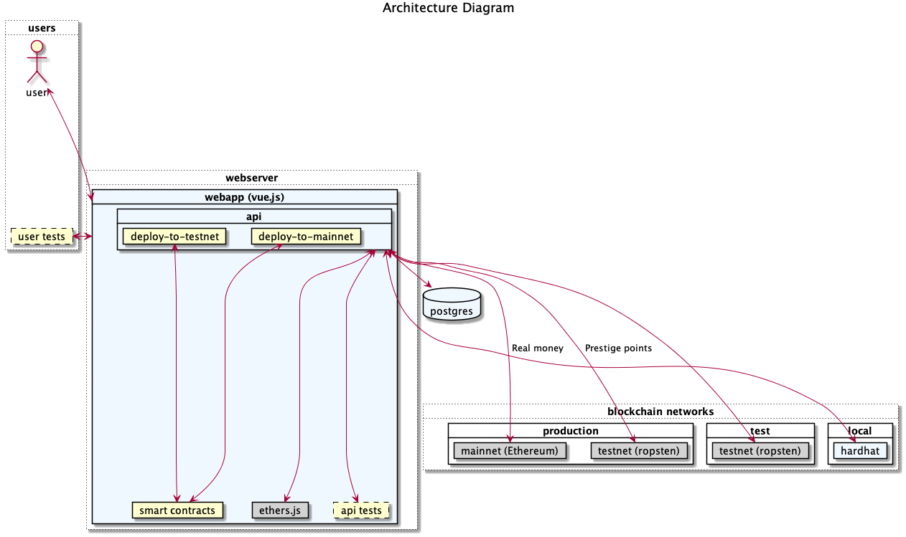
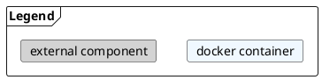

# Bragging Rights






This architecture supports the following deployment/testing configurations:

1. Local development and testing
2. Testnet deployment and testing 
3. Production deployment for prestige-based propositions
4. Production deployment for Ether-based propositions

---

## Local development and testing

For development, we'll use a docker compose cluster with the following containers:

* **braggingrights/hardhat-server**: an entirely local blockchain network that's created on demand using the hardhat framework
  * hardhat on tcp/8545
* **braggingrights/postgres**
  * postgres on tcp/default
  * credentials: postgres/igotbraggingrights
* **adminer**
  * db  on tcp/8080


### Building

With docker installed, run:

```bash
docker-compose build
```

This should have built the containers above, which we can verify with the `docker images` command.

```
REPOSITORY                      TAG       IMAGE ID       CREATED         SIZE
braggingrights/hardhat-server   latest    83463a246dea   11 hours ago    1.4GB

...
```

### Running with docker compose

```bash
docker-compose up 
```

### Running just the blockchain

To start up the local blockchain net, available on `localhost:8545`, run:

```bash
docker run -p 8545:8545/tcp --name bragserver -it braggingrights/hardhat-server:latest
```

If you've done this previously, you might run into a container name conflict. If so, run `docker rm bragserver` to get rid of the old container. 

Otherwise, if everything worked correctly, you should see something like this:

```
Started HTTP and WebSocket JSON-RPC server at http://0.0.0.0:8545/

Accounts
========
Account #0: 0xf39fd6e51aad88f6f4ce6ab8827279cfffb92266 (10000 ETH)
Private Key: 0xac0974bec39a17e36ba4a6b4d238ff944bacb478cbed5efcae784d7bf4f2ff80

Account #1: 0x70997970c51812dc3a010c7d01b50e0d17dc79c8 (10000 ETH)
Private Key: 0x59c6995e998f97a5a0044966f0945389dc9e86dae88c7a8412f4603b6b78690d

...
```

For an interactive shell into your container, run:

`docker exec -it bragserver /bin/bash`

Alternatively, for a quicker iteration loop with fewer docker container rebuilds, you might map your src directory by adding `-v $(pwd):/opt/src` to your `docker run` command. Note that the `/opt/src` directory is laid out a little differently than directory structure in `/opt/braggingrights`, which is dictated by the Dockerfile.

```bash
docker run -p 8545:8545/tcp --name bragserver -it -v $(pwd):/opt/src braggingrights/hardhat-server:latest
```

### Testing

To run tests with hardhat:

```bash
root@1a7484c2dc90:/opt/braggingrights# npx hardhat test


  Proposition
Proposition deployed to: 0x5FbDB2315678afecb367f032d93F642f64180aa3
Title: Will this proposition work?
Wager: BigNumber { _hex: '0x00', _isBigNumber: true }
    ✓ Should allow a member to place a bet (82ms)
    ✓ Should revert a bet from a non-member
    ✓ Should allow a member to add another member (82ms)

  EqualAnteProposition
EqualAnteProposition deployed to: 0xCf7Ed3AccA5a467e9e704C703E8D87F634fB0Fc9
Title: Will this equal ante proposition work?
Wager: BigNumber { _hex: '0x00', _isBigNumber: true }
    ✓ Should allow a member to place a bet (49ms)
    ✓ Should revert a bet from a non-member (51ms)
    ✓ Should allow a member to add another member (71ms)


  6 passing (1s)
```

To run a script with hardhat:

```bash
root@df3c3c4f487f:/opt/braggingrights# npx hardhat run --network localhost scripts/sample-script.js
Deploying contracts with the account: 0xf39Fd6e51aad88F6F4ce6aB8827279cffFb92266
Account balance: 10000000000000000000000
Proposition deployed to: 0x5FbDB2315678afecb367f032d93F642f64180aa3
Wager pool before bet: BigNumber { _hex: '0x00', _isBigNumber: true }
My current wager: BigNumber { _hex: '0x00', _isBigNumber: true }
Wager pool after bet: BigNumber { _hex: '0x01', _isBigNumber: true }
My new wager: BigNumber { _hex: '0x01', _isBigNumber: true }
```

Run a custom hardhat script defined in `hardhat.config.js`:

```bash
root@f380d27ab980:/usr/app# npx hardhat accounts
0xf39Fd6e51aad88F6F4ce6aB8827279cffFb92266
0x70997970C51812dc3A010C7d01b50e0d17dc79C8
0x3C44CdDdB6a900fa2b585dd299e03d12FA4293BC
0x90F79bf6EB2c4f870365E785982E1f101E93b906
0x15d34AAf54267DB7D7c367839AAf71A00a2C6A65
0x9965507D1a55bcC2695C58ba16FB37d819B0A4dc
0x976EA74026E726554dB657fA54763abd0C3a0aa9
0x14dC79964da2C08b23698B3D3cc7Ca32193d9955
0x23618e81E3f5cdF7f54C3d65f7FBc0aBf5B21E8f
0xa0Ee7A142d267C1f36714E4a8F75612F20a79720
0xBcd4042DE499D14e55001CcbB24a551F3b954096
0x71bE63f3384f5fb98995898A86B02Fb2426c5788
0xFABB0ac9d68B0B445fB7357272Ff202C5651694a
0x1CBd3b2770909D4e10f157cABC84C7264073C9Ec
0xdF3e18d64BC6A983f673Ab319CCaE4f1a57C7097
0xcd3B766CCDd6AE721141F452C550Ca635964ce71
0x2546BcD3c84621e976D8185a91A922aE77ECEc30
0xbDA5747bFD65F08deb54cb465eB87D40e51B197E
0xdD2FD4581271e230360230F9337D5c0430Bf44C0
0x8626f6940E2eb28930eFb4CeF49B2d1F2C9C1199
```

---

## Testnet deployment and testing (on Ropsten)

### Building

`dockerfiles/build_docker.sh`


### Testing

Running the container that has the compiled solidity:

`docker rm bragapp; docker run --name bragapp -it braggingrights/webapp:latest .`

Get a shell to the container:

`docker exec -it bragapp /bin/bash`

In the shell:

`node scripts/deploy-to-testnet.js`

Output:

```bash
root@bragapp# node scripts/deploy-to-testnet.js
Wallet {
  _isSigner: true,
  _signingKey: [Function (anonymous)],
  _mnemonic: [Function (anonymous)],
  address: '0xf39Fd6e51aad88F6F4ce6aB8827279cffFb92266',
  provider: AlchemyProvider {
    _isProvider: true,
    _events: [],
    _emitted: { block: -2 },
    formatter: Formatter { formats: [Object] },
    anyNetwork: false,
    _network: {
      name: 'ropsten',
      chainId: 3,
      ensAddress: '0x00000000000C2E074eC69A0dFb2997BA6C7d2e1e',
      _defaultProvider: [Function]
    },
    _maxInternalBlockNumber: -1024,
    _lastBlockNumber: -2,
    _pollingInterval: 4000,
    _fastQueryDate: 0,
    connection: {
      allowGzip: true,
      url: 'https://eth-ropsten.alchemyapi.io/v2/_gg7wSSi0KMBsdKnGVfHDueq6xMB9EkC',
      throttleCallback: [Function: throttleCallback]
    },
    _nextId: 42,
    apiKey: '_gg7wSSi0KMBsdKnGVfHDueq6xMB9EkC'
  }
}
Account balance: 0.99726994
Proposition address: 0xF62eEc897fa5ef36a957702AA4a45B58fE8Fe312
Account balance: 0.99726994
Proposition title: Sample EAProp
Proposition pool: BigNumber { _hex: '0x00', _isBigNumber: true }
```

View the deployed proposition on Ropsten via the Etherscan tool, replacing the address below with the proposition address output in the script above: 

ropsten.etherscan.io/address/0xF62eEc897fa5ef36a957702AA4a45B58fE8Fe312

---

## Production deployment

*Pending*

---


## Building with Waffle

```
npm run build
cd testwaffle; tsc --resolveJsonModule; cd ..
npm run waffletest
```